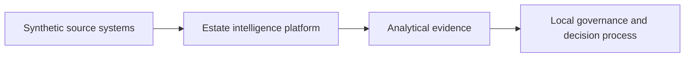
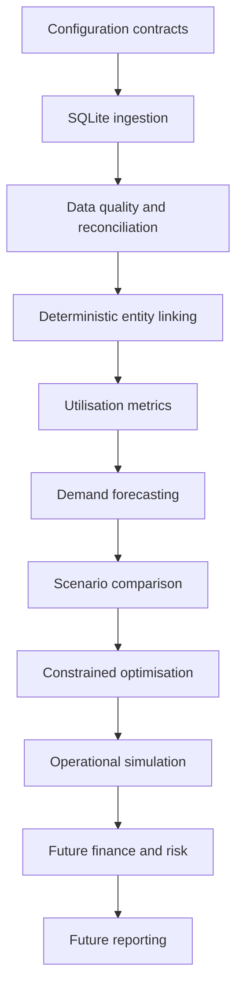

# Architecture

## System Context

## Logical Components

Milestone 1 implemented configuration, CLI, logging, path helpers, documentation and tests. Milestone 2 implemented the
deterministic synthetic source-data layer. Milestone 3 implements local SQLite ingestion, staging, curated tables,
entity-linkage evidence and views. Milestone 4 implements data-quality rules, reconciliation evidence, scoring and a
manual-review queue. Milestone 5 implements quality-gated utilisation metrics. Milestone 6 implements deterministic
demand forecasting with chronological validation. Milestone 7 implements deterministic scenario comparison evidence.
Milestone 8 implements constrained mathematical allocation optimisation. Milestone 9 implements deterministic
operational simulation evidence. Finance, risk, dashboards and recommendation logic remain future boundaries.

## Data Flow

Current data generation produces deterministic synthetic source extracts in `data/sample/`. Milestone 3 loads those
extracts into source, staging, curated and evidence tables. Milestone 4 evaluates those tables through configured
quality rules and writes `evidence_quality_*` records plus ignored exports in `outputs/data_quality/`. Milestone 5
writes utilisation evidence, Milestone 6 writes forecast evidence, Milestone 7 writes scenario appraisal evidence,
Milestone 8 writes optimisation evidence and Milestone 9 writes simulation evidence. Future data will move into
finance, reporting and governance views. Analytical evidence will remain separate from governance approval.

## Package Boundaries

`metrics`, `forecasting`, `scenarios`, `optimisation` and `simulation` are implemented for Milestones 5 through 9.
`financial`, `risk`, `reporting` and `recommendations` remain reserved for future milestones.

## Decision-Support Outputs

Later outputs may include executive summaries, estates packs, finance views, operational reports and technical evidence
logs. No such outputs are produced in Milestone 1.
## Milestone 10 Financial Evidence Layer

The financial layer consumes completed Milestone 1-9 evidence and writes only `evidence_financial_*` tables plus deterministic exports under `outputs/financial`. It does not mutate source, staging or curated data. Failed simulation resilience is carried into financial readiness and risk-adjusted realisability.

## Milestone 11 Dashboard Layer

The dashboard reads completed Milestones 1-10 curated and evidence tables through SQLite read-only mode and shared services. It does not run pipelines, write analytical data, deploy publicly, call external APIs or approve estate decisions.

## Milestone 12 Communication Layer

The reporting package creates deterministic audience-specific Markdown, CSV and JSON products plus `evidence_communication_*` tables. It translates existing evidence into governance-ready but non-approving communication products and decision records.

## Milestone 13 Assurance Layer

The assurance package orchestrates existing Milestones 1-12 commands and evidence without adding new business analytics. It writes `evidence_assurance_*` tables, release gates, a deterministic manifest and local release-readiness reports under `outputs/assurance`.
